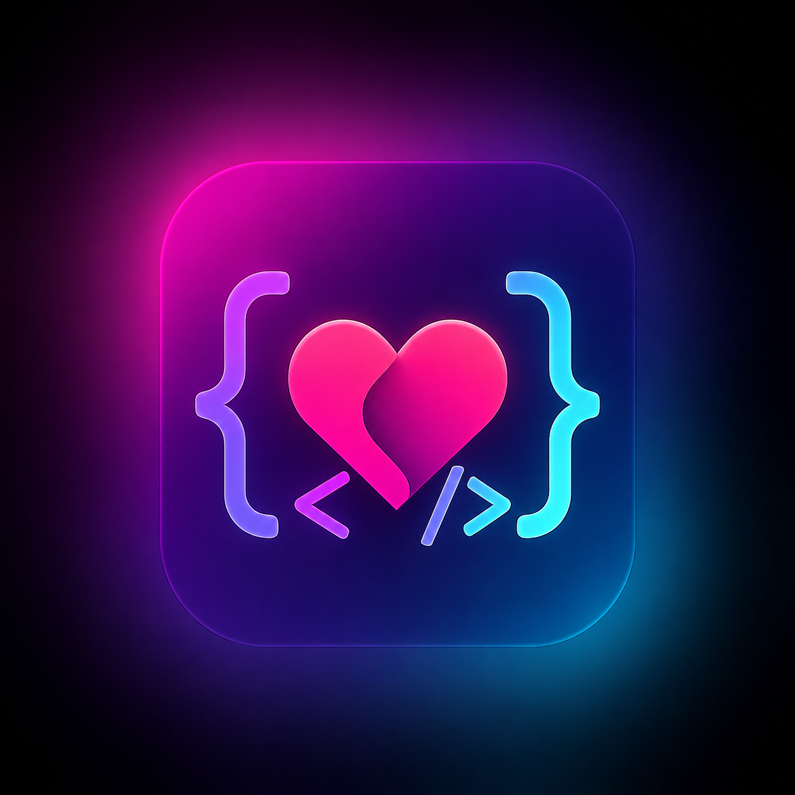

<div align="center">

# 💜 DevDate
### _Where Developers Connect, Collaborate & Find Their Match_



---


### 🚀 Connect • Code • Collaborate • Date

</div>

---

# ✨ About DevDate

**DevDate** is a modern developer-only social & dating platform designed for programmers, designers, engineers, and tech enthusiasts.

Unlike traditional dating apps, DevDate helps developers:
- 💜 Build meaningful relationships
- 🚀 Collaborate on future projects
- 👨‍💻 Connect with like-minded coders
- 🌍 Grow their tech network

> _“Because great connections start with shared passion for code.”_

---

# 🌟 Features

- 🔐 Secure Authentication
- 👨‍💻 Developer Profiles
- 💘 Smart Matching System
- 💬 Real-Time Chat
- 🚀 Collaboration Opportunities
- 🎨 Modern UI/UX Design
- 📱 Fully Responsive Interface

---

# ⚙️ Tech Stack

```yaml
Frontend:
  - React.js
  - TypeScript
  - Tailwind CSS
  - Vite

Backend:
  - Supabase
  - PostgreSQL
```

---

# 📂 Project Structure

```bash
src/
├── components/
├── hooks/
├── integrations/
├── lib/
├── pages/
│   ├── Auth.tsx
│   ├── Discover.tsx
│   ├── Matches.tsx
│   ├── Messages.tsx
│   └── Profile.tsx
└── App.tsx
```

---

# 🚀 Getting Started

## Clone Repository

```bash
git clone https://github.com/2002Souvik/DevDate.git
```

## Install Dependencies

```bash
npm install
```

## Run Development Server

```bash
npm run dev
```

---

# 🔑 Environment Variables

Create a `.env` file:

```env
VITE_SUPABASE_URL=your_project_url
VITE_SUPABASE_ANON_KEY=your_anon_key
```

---

# 🎯 Future Goals

- 🤖 AI Match Suggestions
- 🐙 GitHub Integration
- 🎙️ Voice & Video Calls
- 📱 Mobile Application
- 🏆 Developer Badges

---

# 👨‍💻 Author

### Made with 💜 by Souvik Dhar

🌐 GitHub:  
https://github.com/2002Souvik

---

<div align="center">

## 💜 DevDate

### _Code Together. Grow Together._

</div>